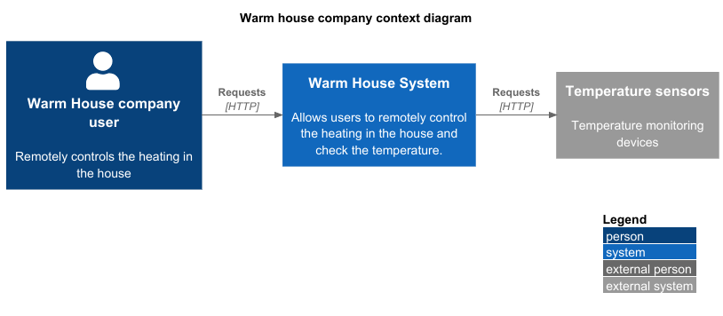
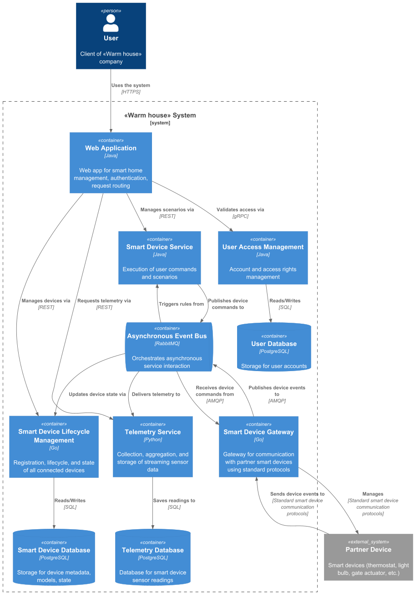
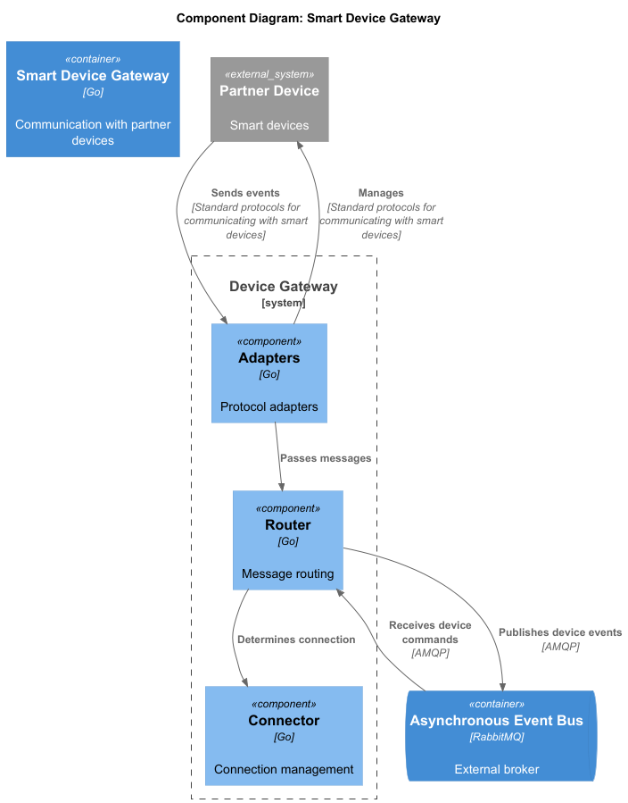
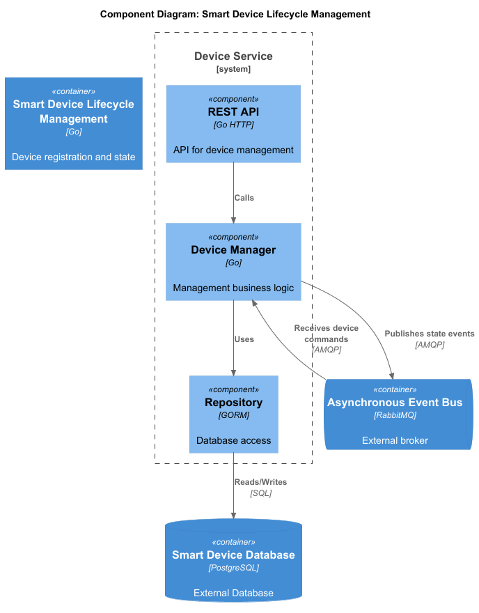
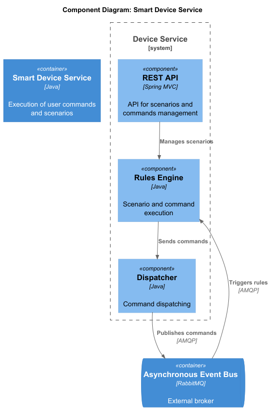
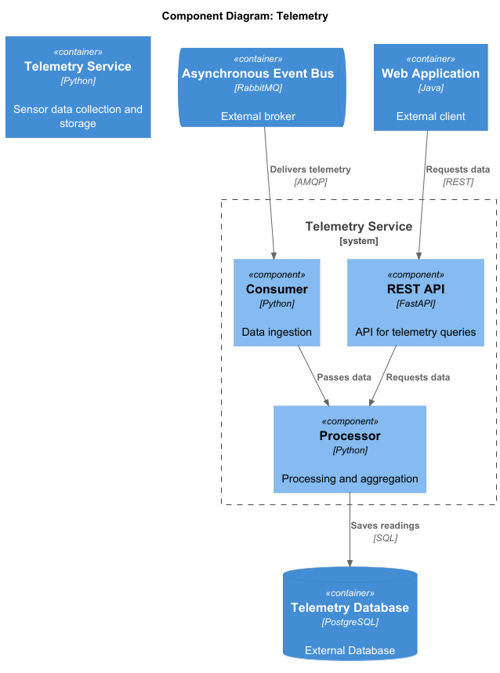
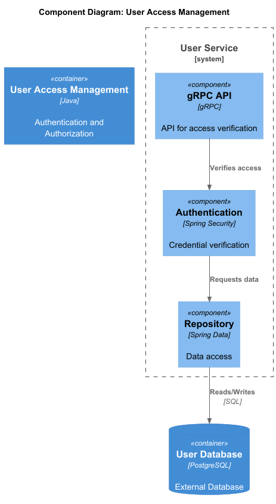
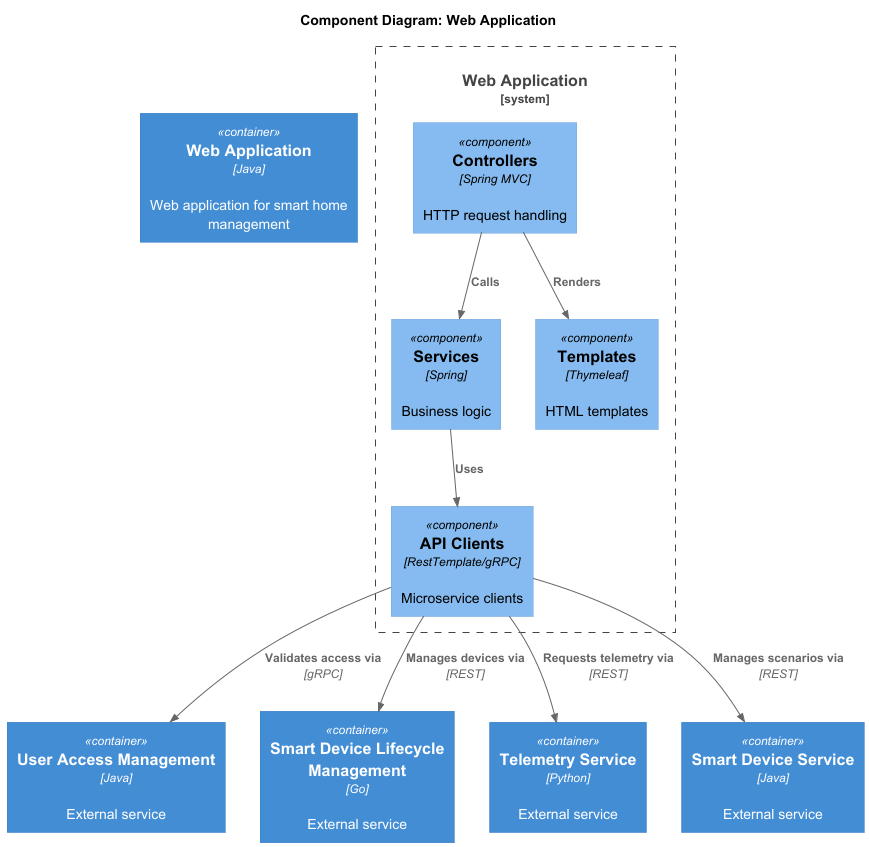
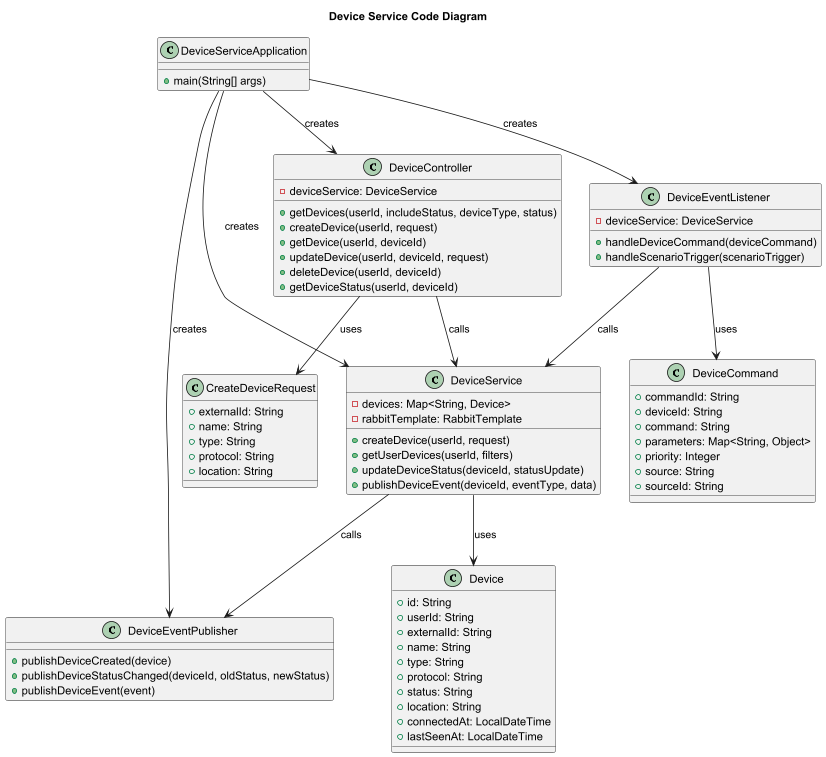
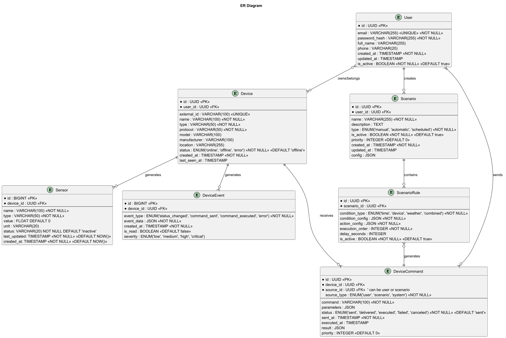

# Задание 1. Анализ и планирование

### 1. Описание функциональности монолитного приложения

**Управление отоплением:**

- Пользователи могут удалённо включать/выключать отопление в своих домах
- Система поддерживает управление отоплением: обработка запросов на включение и отключение

**Мониторинг температуры:**

- Пользователи могут просматривать текущую температуру с датчиков
- Система поддерживает получение и данных с датчиков, установленных в домах

### 2. Анализ архитектуры монолитного приложения

Перечислите здесь основные особенности текущего приложения: какой язык программирования используется, какая база данных, как организовано взаимодействие между компонентами и так далее.
- Язык программирования: Go
- База данных: PostgreSQL
- Взаимодействие между компонентами: Синхронное через HTTP, запросы обрабатываются последовательно
- Архитектура: Монолитная, все компоненты системы (обработка запросов, бизнес-логика, работа с данными) находятся в рамках одного приложения
- Масштабируемость: Ограничена, так как монолит сложно масштабировать по частям
- Развертывание: Требует остановки всего приложения

### 3. Определение доменов и границы контекстов

- **Домен**: удалённое управление отоплением в доме
  - **Поддомен**: мониторинг температуры
    - **Контекст**: просмотр текущей температуры с датчика
    - **Контекст**: добавление и удаление датчиков
  - **Поддомен**: управление умными устройствами
    - **Контекст**: добавление и регистрация новых устройств
    - **Контекст**: изменение состояния устройства

### **4. Проблемы монолитного решения**

- Трудно масштабировать отдельные компоненты системы
- Изменения в одной части приложения могут непредсказуемо влиять на другие части
- Трудно управлять командой
- Длительные циклы разработки и развёртывания

### 5. Визуализация контекста системы — диаграмма С4

# Задание 2. Проектирование микросервисной архитектуры

**Диаграмма контейнеров (Containers)**

**Диаграмма компонентов (Components)**

**Диаграмма кода (Code)**

# Задание 3. Разработка ER-диаграммы

# Задание 4. Создание и документирование API

### 1. Тип API

Используется несколько типов API для взаимодействия:
* REST API - для внешних и большинства внутренних синхронных вызовов. Выбор обусловлен его универсальностью, простотой использования и богатой экосистемой инструментов
* gRPC - для внутренней коммуникации, где критичны низкая задержка и высокая пропускная способность (например, аутентификация)
* AMQP - для телеметрии, команд и уведомлений. Обеспечивает слабую связанность, отказоустойчивость и позволяет эффективно обрабатывать потоки событий
* Специализированные IoT-протоколы (MQTT и др.) - для эффективной и надежной связи с физическими устройствами умного дома

### 2. Документация API

- [device_management](openapi/device_management.yaml)
- [device_service](openapi/device_service.yaml)
- [message_brocker](openapi/message_brocker.yaml)
- [telemetry_service](openapi/telemetry_service.yaml)
- [user_service_proto](openapi/user_service.proto)
- [user_service](openapi/user_service.yaml)

# Задание 5. Работа с docker и docker-compose

- [temperature-api](apps/temperatureapi)
- [docker-compose](apps/docker-compose.yml)

# **Задание 6. Разработка MVP**

Необходимо создать новые микросервисы и обеспечить их интеграции с существующим монолитом для плавного перехода к микросервисной архитектуре. 

### **Что нужно сделать**

1. Создайте новые микросервисы для управления телеметрией и устройствами (с простейшей логикой), которые будут интегрированы с существующим монолитным приложением. Каждый микросервис на своем ООП языке.
2. Обеспечьте взаимодействие между микросервисами и монолитом (при желании с помощью брокера сообщений), чтобы постепенно перенести функциональность из монолита в микросервисы. 

В результате у вас должны быть созданы Dockerfiles и docker-compose для запуска микросервисов. 